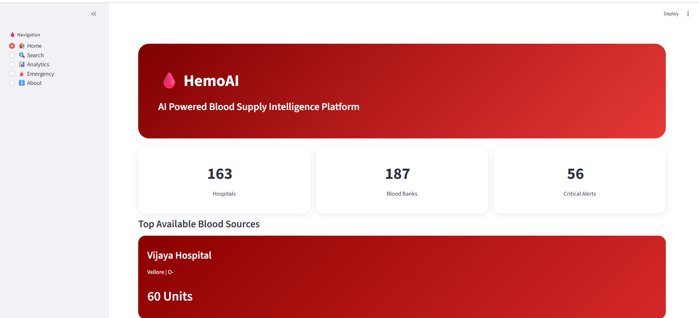
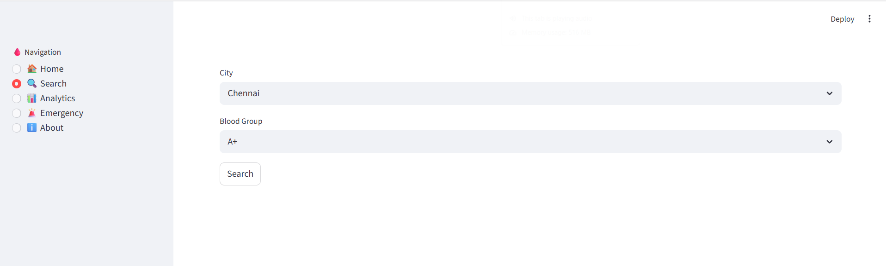
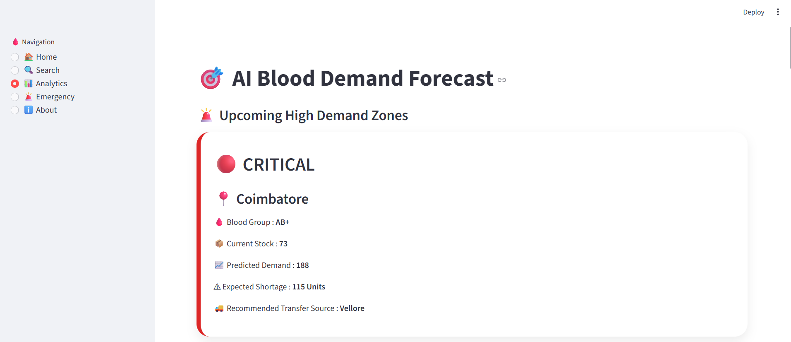
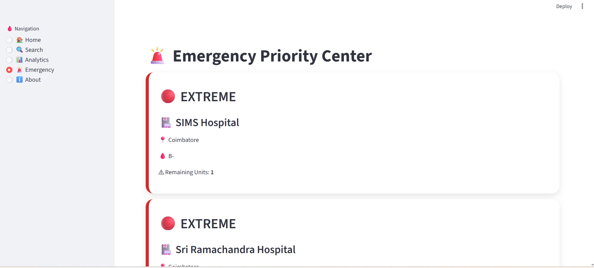
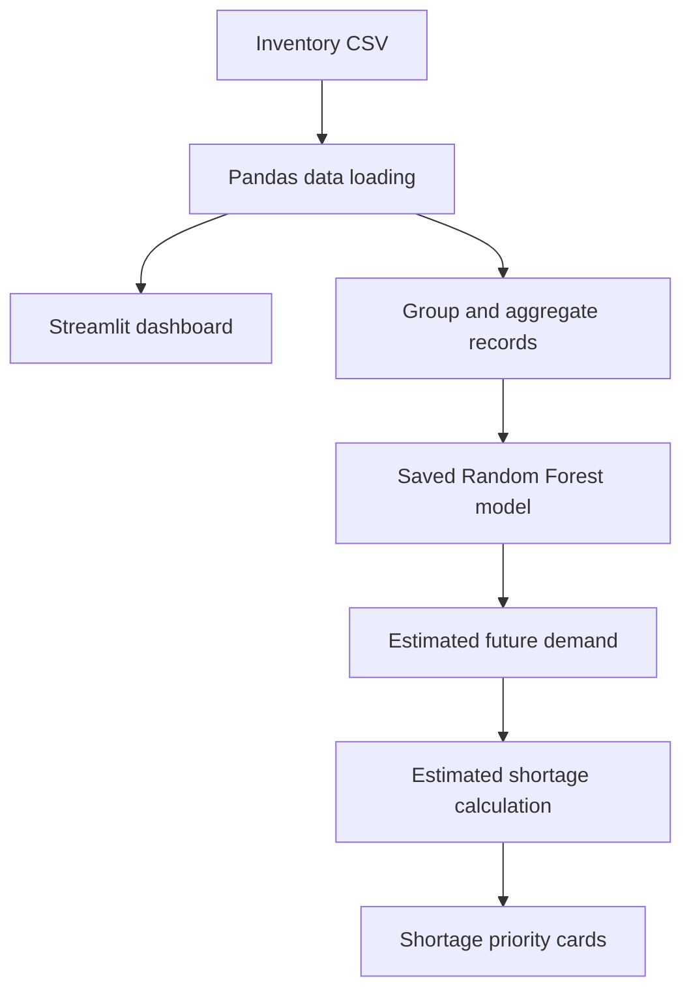

<div align="center">

# 🩸 HemoAI
### AI-Powered Blood Supply Intelligence Platform

**A prototype for exploring blood inventory, identifying low-stock locations, and estimating future blood demand using machine learning.**

[Features](#-features) • [Architecture](#-how-it-works) • [Installation](#-installation) • [Screenshots](#-screenshots) • [Limitations](#-limitations)

</div>

---

## 📌 Overview

Hospitals and blood banks need timely visibility into blood-group availability. Poor inventory visibility can make it harder to identify potential shortages and coordinate supplies.

**HemoAI** is a Python and Streamlit prototype that brings blood inventory records, search, low-stock alerts, and a Random Forest demand-estimation model into one dashboard. It is intended for learning and demonstration, using a local CSV dataset rather than a live hospital or blood-bank system.

> **Project status:** Prototype / educational project. The data and predictions have not been validated for real-world clinical or blood-bank operations.

## 🎯 Problem Statement

Blood inventory is time-sensitive and varies by location and blood group. A simple dashboard can help users explore stock levels and identify records that may need attention. A forecasting model can also demonstrate how historical demand-related fields might be used to estimate future demand.

## ✨ Features

- **Inventory overview:** Displays hospital and blood-bank record counts, low-stock alerts, and high-stock records.
- **Blood inventory search:** Filters records by city and blood group.
- **Demand estimation:** Uses a saved `RandomForestRegressor` model to estimate `Future_Demand` from `Emergency_Requests`, `Daily_Usage`, and `Units_Available`.
- **Shortage prioritization:** Compares estimated demand with available units and sorts locations by estimated shortage.
- **Low-stock view:** Highlights records with fewer than 10 available units and assigns a simple priority label.
- **Transfer-source suggestion:** Suggests a record's city with comparatively high stock for the same blood group. This is a basic heuristic, not a validated logistics or compatibility engine.

## 🧰 Tech Stack

| Technology | Purpose |
|---|---|
| Python | Application and model code |
| Streamlit | Interactive web interface |
| Pandas | CSV loading and data aggregation |
| Scikit-learn | Random Forest regression |
| Joblib | Saving and loading the trained model |
| CSV | Prototype inventory dataset |


## 🖥️ Screenshots

Add screenshots captured from your actual running application to the `screenshots/` folder. Do not use mockups as evidence of implemented features.

Once the images exist, update the filenames below if needed:

| Dashboard | Inventory search |
|---|---|
| `screenshots/dashboard.png` | `screenshots/search.png` |

| Demand analytics | Low-stock alerts |
|---|---|
| `screenshots/analytics.png` | `screenshots/emergency.png` |
<!-- After adding the image files, uncomment these lines:




-->

## 🏗️ How It Works



### Model workflow

1. `train_model.py` reads `dataset/blood_inventory.csv`.
2. The input features are `Emergency_Requests`, `Daily_Usage`, and `Units_Available`.
3. The target column is `Future_Demand`.
4. The script splits the rows into training and test subsets, trains a `RandomForestRegressor`, and saves the model as `blood_demand_model.pkl`.
5. The Streamlit analytics page loads the saved model and uses its estimates to calculate:

   `Estimated shortage = Estimated future demand − Available units`

**Important:** The current training script creates a test split but does not report evaluation metrics. Model quality therefore has not yet been demonstrated. Before making performance claims, evaluate the model on held-out data using metrics such as MAE and RMSE, and document the results.

## 📁 Project Structure

```text
HemoAI/
├── app.py
├── train_model.py
├── blood_demand_model.pkl
├── dataset/
│   └── blood_inventory.csv
├── screenshots/
│   ├── dashboard.png
│   ├── search.png
│   ├── analytics.png
│   └── emergency.png
├── requirements.txt
├── .gitignore
└── README.md
```

## ⚙️ Installation

### Prerequisites

- Python 3.10 or a compatible version supported by the listed packages
- Git

### 1. Clone the repository

```bash
git clone https://github.com/mahalakshmia14/HemoAl-Al-Powered-Blood-Supply-Intelligence-Platform.git
cd HemoAl-Al-Powered-Blood-Supply-Intelligence-Platform
```

### 2. Create and activate a virtual environment

**Windows (Command Prompt):**

```bat
python -m venv .venv
.venv\Scripts\activate
```

**macOS / Linux:**

```bash
python3 -m venv .venv
source .venv/bin/activate
```

### 3. Install dependencies

```bash
python -m pip install --upgrade pip
pip install -r requirements.txt
```

### 4. Run the app

```bash
streamlit run app.py
```

Streamlit will print a local URL in the terminal, usually `http://localhost:8501`.

### 5. Retrain the model (optional)

The repository includes a saved model. To retrain it from the CSV:

```bash
python train_model.py
```

Run commands from the repository root so the relative dataset and model paths resolve correctly.

## 🧪 Validation Checklist

Before describing this project as complete, verify:

- [ ] The app starts in a clean virtual environment.
- [ ] Every navigation page opens without errors.
- [ ] Search filters the expected city and blood group.
- [ ] The dataset schema matches the fields referenced by the app.
- [ ] Retraining produces a model that the app can load.
- [ ] Held-out model performance is measured and documented.
- [ ] Estimated shortages are handled sensibly when the estimate is below available stock.
- [ ] Screenshots are captured from the actual application.
- [ ] All data is clearly identified as simulated or real, as applicable.

## ⚠️ Limitations and Responsible Use

- This repository is an educational prototype, not a production blood-bank management system.
- Do not use its forecasts or transfer suggestions to make real clinical, transfusion, or inventory-allocation decisions.
- Confirm whether the dataset is simulated and label it clearly. Do not imply that example hospital names or inventory figures are verified live data.
- The current model script does not print validation metrics, and no model-accuracy claim is made here.
- The transfer-source logic is a simple stock-based heuristic. It does not validate transport time, expiry, crossmatching, component type, local policies, or actual availability.
- The app currently reads a local CSV and saved model; it is not connected to a live hospital, blood-bank, or SAP system.

## 🛣️ Roadmap

- [ ] Add `requirements.txt` and document a reproducible Python environment.
- [ ] Add model evaluation metrics and a reproducible training workflow.
- [ ] Improve data validation and missing-value handling.
- [ ] Add clearer hospital/blood-bank and blood-group filters to analytics.
- [ ] Add expiry-aware inventory warnings, after validating date formats and rules.
- [ ] Improve the layout and capture genuine application screenshots.
- [ ] Add automated tests for data processing and shortage calculations.
- [ ] Consider deployment only after dependencies, data handling, and model limitations are documented.

## 👩‍💻 Author

**Mahalakshmi A**  
Biomedical Engineering student interested in healthcare analytics, Python, and machine learning.

- GitHub: [@mahalakshmia14](https://github.com/mahalakshmia14)

---

If you find a bug or have a suggestion, open an issue in the repository.
